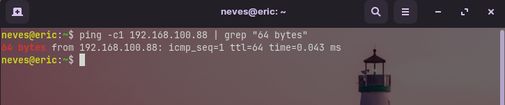

### Find IP address

    

Script escrito em bash, que possui a finalidade de encontrar endereços IP's conectados na rede interna.

### Funcionamento

Iremos seguir a ordem de execução do script e entender o seu simples e poderoso funcionamento.

Primeiro é preciso entender a classe de IP de sua rede interna, no exemplo é utilizado o IP de classe C: <b>192.168.100.{host}</b>, em que os dispositivos conectados correspodem apenas ao último campo: <b>{host}.</b>

 

O comando abaixo é um simples <b>ping</b>, enviando apenas uma contagem <b>-c1</b>. Uma vez que o IP inserido está conectado, é retornado <b>64 bytes</b>, a partir deste ponto iremos filtrar as informações.

O comando <b>grep "64 bytes"</b> retorna apenas o IP conectado.

Lembrando que o caracter <b>|</b> separa um comando por vez.

O comando <b>awk '{print $4}'</b> retorna o trecho da 4ª coluna.

O comando <b>sed 's/://'</b> retira o caracter <b>':'</b>, ao invés de <b>192.168.100.1:</b>, o resultado é <b>192.168.100.1</b>, e é isso, a lógica está pronta.

Antes de montar o script, o código abaixo retorna uma lista de valores que serão os possíveis hosts conectados na rede. A variavél <b>$i</b> será inserida de forma dinâmica, por exemplo: <b>192.168.100.$i</b>, resultando numa lista de IP's.

Após entendermos a lógica, vamos criar o script e adicionar a permissão de execução. Sendo que <b>nano</b> foi o editor que escolhi.

E essa foi a execução e o resultado do script, podendo ser uma ferrament muito útil para diversos contextos.

### License

